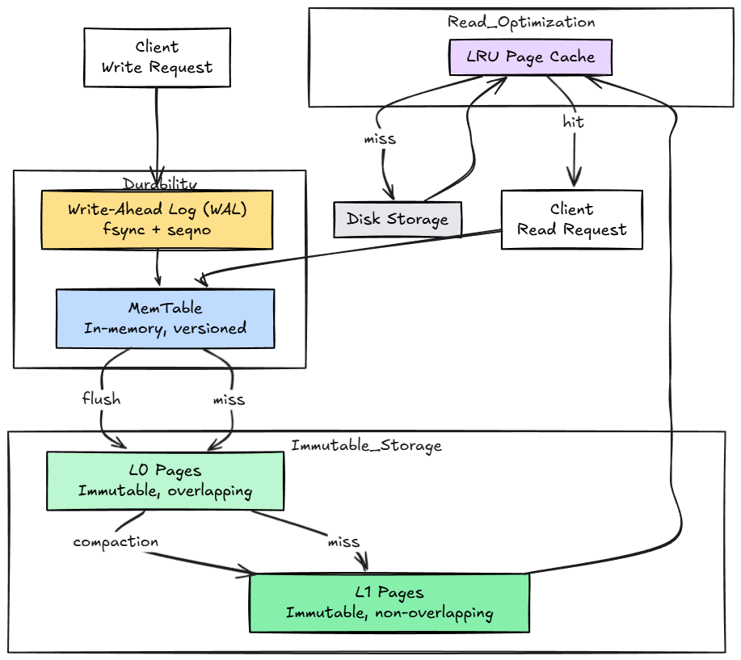

# ShunyaDB

**ShunyaDB** is a lightweight, embedded storage engine written in **Rust**, designed around **durability, immutability, and snapshot-consistent reads**.

It provides a **crash-safe core database layer** with a clear internal architecture that can be extended with compaction, indexing, and higher-level query layers.

ShunyaDB focuses on being **correct first**, with explicit guarantees about how data is written, persisted, and recovered.

---

## Features

ShunyaDB currently provides:

- **Durable writes**
  - Write-Ahead Log (WAL) with fsync
  - Strict commit ordering using sequence numbers

- **Snapshot-consistent reads**
  - MVCC (multi-version concurrency control)
  - Reads at a chosen snapshot without locking

- **Immutable on-disk storage**
  - Data is flushed into immutable page files
  - Pages are never modified once written

- **Crash-safe recovery**
  - WAL replay on startup
  - Checkpoint-based recovery to avoid duplicate writes
  - Safe handling of partial or interrupted writes

- **Delete support**
  - Deletes are represented as versioned tombstones
  - Tombstones correctly hide older versions

- **Cross-platform storage**
  - Works on Linux, macOS, and Windows
  - Uses platform-safe file IO patterns

---

## High-Level Architecture


- **WAL** ensures durability
- **MemTable** stores versioned records in memory
- **Immutable Pages** store persisted data on disk
- **Metadata** tracks page layout and recovery state

---

## Data Model

- Records are identified by a string key
- Each write creates a new version with a monotonically increasing sequence number
- Deletes are stored as tombstones
- Reads specify a snapshot sequence number and return the correct visible version

---

## Persistence Guarantees

ShunyaDB guarantees:

- Once a write is acknowledged, it will survive process or system crashes
- Data is never partially visible on disk
- On restart, the database recovers to a consistent state
- Reads never observe torn or corrupted records

---

## Example Usage

```rust
use shunyadb::engine::engine::Engine;
use std::collections::BTreeMap;

let mut engine = Engine::open("./data")?;

let mut value = BTreeMap::new();
value.insert("name".to_string(), "shunya".into());

engine.put("key1".to_string(), value)?;
engine.flush()?;

// Snapshot read
let snapshot = shunyadb::engine::seqno::current_seqno();
let record = engine.get("key1", snapshot);

assert!(record.is_some());
```

---

## Testing & Reliability

The project includes:

- Unit tests for core components (WAL, pages, memtable)
- Integration tests that:
  - write thousands of records to disk
  - restart the engine
  - verify data integrity and recovery correctness

These tests validate **real on-disk persistence**, not in-memory behavior.

---

## Project Status

ShunyaDB is currently an **embedded storage engine**, suitable as a foundation for:

- custom databases
- local persistence layers
- research and learning projects
- systems that need deterministic storage behavior

Higher-level features (compaction, indexing, query layers) would be built **on top of** this core.

